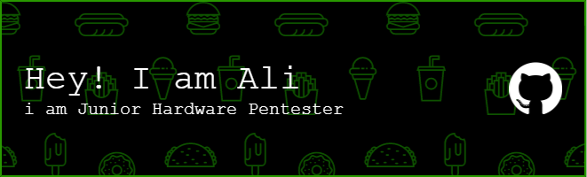

<h1 align="center">Hi 👋, I'm Ali</h1>
<h3 align="center">A passionate Hardware & IOT Junior Pentester and a Hobbiest frontend developer from Pakistan</h3>

  

- 🔭 I’m currently working on **RF-Clown**

- 🌱 I’m currently learning **Junior Soc Analyst**

- 👯 I’m looking to collaborate with and work as the great man he is [ciphertech](https://github.com/cifertech)

- 🤝 I’m looking for help with **Networking,PCB designing**

<h3 align="left">Connect with me:</h3>

<h3 align="left">Languages and Tools:</h3>

              

&nbsp;

